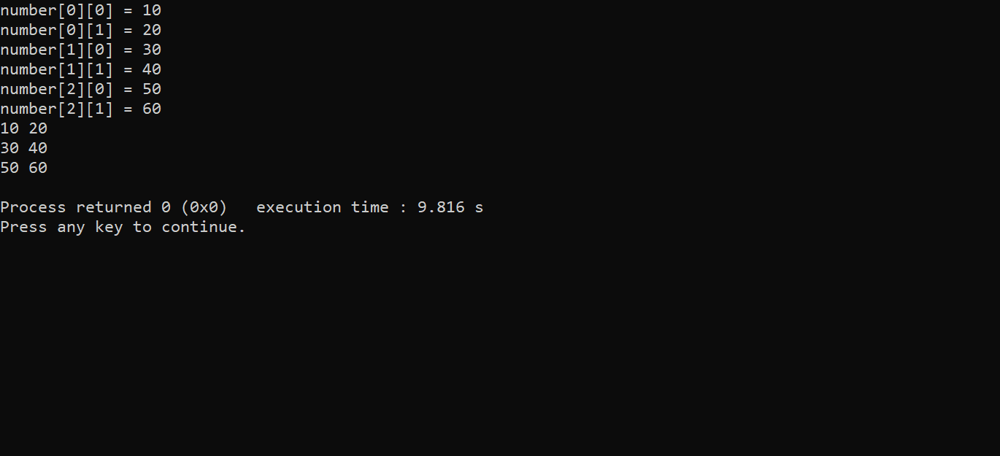

<!--Array-->
_A_~~rr~~__a__`y`

```c
#include<stdio.h>
int main()
{
    int number[5];

    number[0] = 10;
    number[1] = 20;
    number[2] = 30;
    number[3] = 40;
    number[4] = 50;

    printf("%d\n",number[0]);
    printf("%d\n",number[1]);
    printf("%d\n",number[2]);
    printf("%d\n",number[3]);
    printf("%d\n",number[4]);

    return 0;
}
```


</br>

### another stayle

```c
#include<stdio.h>
int main()
{
    int numbers[5] = {10,20,30,40,50};

    printf("%d\n",numbers[0]);
    printf("%d\n",numbers[1]);
    printf("%d\n",numbers[2]);
    printf("%d\n",numbers[3]);
    printf("%d\n",numbers[4]);

    return 0;
}
```


### another short

```c
#include<stdio.h>
int main()
{
    int numbers[] = {10,20,30,40,50};

    printf("%d\n",numbers[0]);
    printf("%d\n",numbers[1]);
    printf("%d\n",numbers[2]);
    printf("%d\n",numbers[3]);
    printf("%d\n",numbers[4]);

    return 0;
}  
```
<image src="./images/ar2.png" width="500" title="pic"/>

### array decliaration and initialization shortcut

```c
#include<stdio.h>
int main()
{
    int numbers[] = {10,20,30,40,50};

    for(int index=0; index<5; index++)
    {
        printf("%d\n",numbers[index]);
    }

    return 0;
}  
```  

<image src="./images/ar3.png" width="500" title="Third"/>


### sum with array

```c
#include<stdio.h>
int main()
{
    while(1)
    {
        int numbers[5],sum=0;

        for(int  index=0; index<5; index++)
        {
            printf("number[%d] : ",index+1);
            scanf("%d",&numbers[index]);
            sum=sum+numbers[index];
            printf(" = %d\n",sum);
        }

        printf("Total number is : %d\n",sum);
    }
}
```

<image src="./images/sum.png" width="500" title="sum"/>

### sum & average

```c
#include<stdio.h>
int main()
{
    while(1)
    {
        int numbers[5],sum=0;
        float average;

        for(int  index=0; index<5; index++)
        {
            printf("number[%d] : ",index+1);
            scanf("%d",&numbers[index]);
        }

        for(int index=0; index<5; index++)
        {
            sum=sum+numbers[index];
        }

        printf("Total number is : %d\n",sum);
        printf("average = %f",(float)sum/5);
    }
}
```

</br>

### 
```c
#include<stdio.h>
int main()
{
    while(1)
    {
        int numbers[5],sum=0;
        float average;

        for(int  index=0; index<5; index++)
        {
            printf("number[%d] : ",index+1);
            scanf("%d",&numbers[index]);
        }

        for(int index=0; index<5; index++)
        {
            sum=sum+numbers[index];
        }

        printf("Total number is : %d\n",sum);
        printf("average = %.2f",(float)sum/5);
    }
}
```

  

### Maximum

```c
#include<stdio.h>
int main()
{
    int numbers[]={999,15,20,45,-15,-20};

    max=number[0];

    for(int i=1; i<6; i++)
    {
        if(max<number[i])
        {
            max=number[i];
        }
    }

    printf("maximum number is : %d",max);

    return 0;
}
```

<image src="./images/maximum.png" width="500" heigh="500" title="maximum" />  

### minimum

```c
#include<stdio.h>
int main()
{
    int number[]={999,15,20,45,-15,-20};

    min=number[0];

    for(int i=1; i<6; i++)
    {
        if(number[i]<min)
        {
            min=number[i];
        }
    }

    printf("minimum number is = %d",min);

    return 0;
}
```  
</br>

  

### minimum & maximum

```c
#include<stdio.h>
int main()
{
    int numbers[]={10,20,30,999,-4,-20};

    int maximum=numbers[0];
    int minimum=numbers[0];

    for(int i=1; i<6; i++)
    {
        if(maximum<numbers[i])
        {
            maximum=numbers[i];
        }

        if(minimum>numbers[i])
        {
            minimum=numbers[i];
        }
    }

    printf("minimum number is : %d",minimum);
    printf("maximum number is : %d",maximum);

    return 0;
}
```
</br>

<image src="./images/minmax.png" widh="500" title="minmax"/>  

### scanf maxx minn

```c
#include<stdio.h>
int main()
{
    int numbers[5],maximum,minimum;

    for(int i=0; i<5; i++)
    {
        printf("number[%d] = ",i+1);
        scanf("%d",&numbers[i]);
    }
    minimum=numbers[0];
    maximum=numbers[0];

    for(int index=1; index<5; index++)
    {

        if(maximum<numbers[index])
        {
            maximum=numbers[index];
        }

        if(minimum>numbers[index])
        {
            minimum=numbers[index];
        }

    }

    printf("minimum number is : %d\n",minimum);
    printf("maximum number is : %d",maximum);

    return 0;
}
```


</br>

### liner search

```c
#include<stdio.h>
int main()
{
    while(1)
    {
    int numbers[]={10,20,999,-3,-22,144},target,found;

    printf("Enter the finding number : ");
    scanf("%d",&target);

    found = -1;

    for(int i=0; i<6; i++)
    {
        if(target==numbers[i])
        {
            found=i;
            break;
        }
    }

    if(found == -1)
    printf("%d number not found in the list.\n",target);
    else
    printf("%d number is found from the serial of number[%d]\n",target,found);
    }
    return 0;
}  
```  
<image src ="./images/liner.png" widh="500" title="liner search"/>

### serialwise largest two integer

```c
#include<stdio.h>
int main()
{
    int number[]= {10,30},first,second,sizeofarray;

    sizeofarray=sizeof(number)/sizeof(number[0]);

    if(number[0]>number[1])
    {
        first=number[0];
        second=number[1];
    }

    else
    {
        first=number[1];
        second=number[0];
    }

    printf("first number is : %d\n",first);
    printf("second number is : %d\n",second);

    return 0;
}

```
<image src="./images/firstse.png" width="500" title="largest"/>

### first and second largest number

```c
#include<stdio.h>
int main()
{
    int numbers[]={32,45,67,55,66,69,76,9,76},sizeofarray=sizeof(numbers)/sizeof(numbers[0]),first,second;

    if(numbers[0]>numbers[1])
    {
        first=numbers[0];
        second=numbers[1];
    }
    else
    {
        first=numbers[1];
        second=numbers[0];
    }

    for(int index=2; index<sizeofarray; index++)
    {
        if(numbers[index]>first)
        {
            second=first;
            first=numbers[index];
        }
        else
        if(numbers[index]>second && numbers[index]!=first)
        {
            second=numbers[index];
        }
    }

    printf("First number is : %d\n",first);
    printf("Second numebr is : %d\n",second);

    return 0;
}
```  

<image src="./images/three.png" width="500" title="three"/>

</br>

### create a matrix

```c
#include<stdio.h>
int main()
{
    int matrix[3][2]={
        {10,20},
        {30,40},
        {50,60}
    };

    printf("%d ",matrix[0][0]);
    printf("%d ",matrix[0][1]);
    printf("%d ",matrix[1][0]);
    printf("%d ",matrix[1][1]);
    printf("%d ",matrix[2][0]);
    printf("%d ",matrix[2][1]);

    return 0;
}
```

<image src="./images/matrix.png" width="500" title="matrix"/>  

### matrix in short

```c
#include<stdio.h>
int main()
{
    int matrix[3][2]={
        {10,20},
        {30,40},
        {50,60}
    };

    for(int i=0; i<3; i++)
    {
        for(int j=0; j<2; j++)
        {
            printf("%d ",matrix[i][j]);
        }
        printf("\n");
    }
    return 0;
}
```


### using scanf

```c
#include<stdio.h>
int main()
{
    int matrix[3][2];

    for(int row=0; row<3; row++)
    {
        for(int col=0; col<2; col++)
        {
            printf("number[%d][%d] = ",row,col);
            scanf("%d",&matrix[row][col]);
        }
    }

    for(int i=0; i<3; i++)
    {
        for(int j=0; j<2; j++)
        {
            printf("%d ",matrix[i][j]);
        }
        printf("\n");
    }
    return 0;
}
```



</br>

### sum of matrix

```c
#include<stdio.h>
int main()
{
    int A[3][2], B[3][2],C[3][2];

    printf(" A \n");

    for(int row=0; row<3; row++)
    {
        for(int col=0; col<2; col++)
        {
            printf("number[%d][%d] = ",row,col);
            scanf("%d",&A[row][col]);
        }
    }

    for(int i=0; i<3; i++)
    {
        for(int j=0; j<2; j++)
        {
            printf("%d ",A[i][j]);
        }
        printf("\n");
    }

    // B matrix

    printf(" B \n");
        for(int row=0; row<3; row++)
    {
        for(int col=0; col<2; col++)
        {
            printf("number[%d][%d] = ",row,col);
            scanf("%d",&B[row][col]);
        }
    }

    for(int i=0; i<3; i++)
    {
        for(int j=0; j<2; j++)
        {
            printf("%d ",B[i][j]);
        }
        printf("\n");
    }

    printf(" Sum \n");

    for(int i=0; i<3; i++)
    {
        for(int j=0; j<2; j++)
        {
           C[i][j]=A[i][j]+B[i][j];
           printf("%d ",C[i][j]);
        }
        printf("\n");
    }
    return 0;
}
```
</br>


### sum avarage multiply & divition

```c
#include<stdio.h>
int main()
{
    int numbers[]= {15,2,3,4,5},size=sizeof(numbers)/sizeof(numbers[0]),sum=0,multiply=1,subtraction= numbers[0] ;
    float average,division=numbers[0];

    for(int i=0; i<size; i++)
    {
        sum=sum+numbers[i];
        multiply=multiply*numbers[i];

    }

    for(int i=1; i<size; i++)
    {
        division=division/(float)numbers[i];
        subtraction=subtraction-numbers[i];
    }

    for(int space=1; space<=50; space++)
    {
        printf(" ");
    }
    printf("sum = %d\n",sum);
    for(int space=1; space<=50; space++)
    {
        printf(" ");
    }
    printf("average = %.2f\n",(float)sum/size);
    for(int space=1; space<=50; space++)
    {
        printf(" ");
    }
    printf("division = %f\n",division);
    for(int space=1; space<=50; space++)
    {
        printf(" ");
    }
    printf("subtraction = %d",subtraction);
    getch();
}
```

<image src="./images/all.png" width="500" title="picall"/>


_Take_ __limited__ ~~number~~ of `input`

```c
#include<stdio.h>
int main()
{
    int numbers[100],n,sum;
    float average;

    printf("Enter the range of numbers : ");
    scanf("%d",&n);

    for(int i=0; i<n; i++)
    {
        scanf("%d",&numbers[i]);
    }

    for(int j=0; j<n; j++)
    {
        sum=sum+numbers[j];
    }

    printf("sum = %d \n",sum);
    printf("average = %.2f",(float)sum/n);
    getch();
}
```
  
</br>

### normal fibonacci
```c
#include<stdio.h>
int main()
{
    int number,first=0,second=1,i,fibo;

    printf("Enter the series range : ");
    scanf("%d",&number);

    while(i<=number)
    {
        if(i<=1)
        {
            fibo=i;
            printf("%d = %d\n",i,fibo);
        }
        else
        {
            fibo=first+second;
            printf("%d + %d = %d\n",first,second,fibo);
            first=second;
            second=fibo;
        }
        i++;
    }
    return 0;
}
```

</br>

_fibonacci_ __num__~~ber~~ using `array`

```c
#include<stdio.h>
int main()
{
    int number,a[30],n;

    printf("Enter the term of series : ");
    scanf("%d",&n);

    a[0]=0;
    a[1]=1;

    for(int i=0; i<n; i++)
    {
        if(i<=1)
        {
            printf("%d = %d\n",i,a[i]);
        }
        else
        {
            a[i]=a[i-1]+a[i-2];
            printf("%d + %d = %d \n",a[i-2],a[i-1],a[i]);
        }
    }
    return 0;
}
```

<image src="./images/fibonacciarray.png" width="500" title="fibonacci"/>

_created_ ~~by~~ `me`

```c
#include<stdio.h>
int main()
{
    int number[]= {4,5,6,2,1},total,maximum,j,latest,a[30],minimum,update;

    total=sizeof(number)/sizeof(number[0]);
    maximum=number[0];
    minimum=number[0];
    for(int i=1; i<total; i++)
    {
        if(number[i]>maximum)
        {
            maximum=number[i];
        }
        if(number[i]<minimum)
        {
            minimum=number[i];
        }
    }
    latest=maximum;
    printf("minimum = %d \n",minimum);
    printf("latest = %d\n",latest);


    for(int i=1; i<total; i++)
    {
        update=minimum;

        for(j=0; j<total; j++)
        {
            if(number[j]<latest && number[j]>=minimum)
            {
                if(number[j]>=update)
                    maximum=number[j];
                    update=maximum;
                    printf("update = %d\n",update);
            }
        }
        latest=maximum;
        printf("latest %d = %d\n\n",number[i],latest);
    }

    return 0;
}
```


### array copy

```c
// write a programme that print copy of array
#include<stdio.h>
int main()
{
        int a[100],a1[100],num;

        printf("Enter the terms of number : ");
        scanf("%d",&num);

        for(int i=0; i<num; i++)
        {
            printf("number[%d] = ",i);
            scanf("%d",&a[i]);
        }

        printf("array 1 = ");
        for(int i=0; i<num; i++)
        {
            printf("%d ",a[i]);

            a1[i]=a[i];
        }
        printf("\narray 2 = ");
        for(int i=0; i<num; i++)
        {
            printf("%d ",a1[i]);
        }
    getch();
}
```


</br>

### sum

```c
#include<stdio.h>
int main()
{
    while(1)
    {
        int a[3][2],b[3][2],c[3][2],sum=0;
        float average;

        for(int i=0; i<3; i++)
        {
            for(int j=0; j<2; j++)
            {
                printf("a[%d][%d] = ",i,j);
                scanf("%d",&a[i][j]);
            }
        }

        for(int i=0; i<3; i++)
        {
            for(int j=0; j<2; j++)
            {
                printf("b[%d][%d] = ",i,j);
                scanf("%d",&b[i][j]);
            }
        }
        printf("sum :\n");

        for(int i=0; i<3; i++)
        {
            for(int j=0; j<2; j++)
            {
                sum=a[i][j]+b[i][j];
                c[i][j]=sum;
                printf("%d ",c[i][j]);
            }
            printf("\n");
        }
    }
    return 0;
}
```  
<image src="./images/sumnew.png" width="500" title="sum"/>

<!--write a programme that print the value and sum using array & matrix-->

### array input sum matrix

```c
#include<stdio.h>
int main()
{
    while(1)
    {

        int a[100][100],b[100][100],c[100][100],sum,number,row,column;

        printf("enter the terms of row : ");
        scanf("%d",&row);

        printf("enter the terms of column : ");
        scanf("%d",&column);

        printf("\nenter the numbers for group a \n");

        for(int i=0; i<row; i++)
        {
            for(int j=0; j<column; j++)
            {
                printf("a[%d][%d] = ",i,j);
                scanf("%d",&a[i][j]);
            }
            printf("\n");
        }

        printf("\nenter the numbers for group b \n");

        for(int i=0; i<row; i++)
        {
            for(int j=0; j<column; j++)
            {
                printf("b[%d][%d] = ",i,j);
                scanf("%d",&b[i][j]);
            }
            printf("\n");
        }
        printf("\tthe number of A\n");
        for(int i=0; i<row; i++)
        {
            for(int j=0; j<column; j++)
            {
                printf("a[%d][%d] = %d\t",i,j,a[i][j]);
            }
            printf("\n");
        }
        printf("\tthe number of B\n");

        for(int i=0; i<row; i++)
        {
            for(int j=0; j<column; j++)
            {
                printf("b[%d][%d] = %d\t",i,j,b[i][j]);
            }
            printf("\n");
        }
        printf("\tsum \n");

        for(int i=0; i<row; i++)
        {
            for(int j=0; j<column; j++)
            {
                c[i][j]=a[i][j]+b[i][j];
                printf("%d + %d = %d\t",a[i][j],b[i][j],c[i][j]);
            }
            printf("\n\n");
        }
    }
    return 0;
}
```
_in_~~pu~~__t__ `3*2`

</br>

<image src="./images/matrixsum1.png" width="500" title="input3*2"/>

_in_~~p~~u __t__ `3*3`  


</br>

### addition && subtraction

```c
#include<stdio.h>
int main()
{
    while(1)
    {

        int a[100][100],b[100][100],c[100][100],sum,number,row,column;

        printf("enter the terms of row : ");
        scanf("%d",&row);

        printf("enter the terms of column : ");
        scanf("%d",&column);

        printf("\nenter the numbers for group a \n");

        for(int i=0; i<row; i++)
        {
            for(int j=0; j<column; j++)
            {
                printf("a[%d][%d] = ",i,j);
                scanf("%d",&a[i][j]);
            }
            printf("\n");
        }

        printf("\nenter the numbers for group b \n");

        for(int i=0; i<row; i++)
        {
            for(int j=0; j<column; j++)
            {
                printf("b[%d][%d] = ",i,j);
                scanf("%d",&b[i][j]);
            }
            printf("\n");
        }
        printf("\tthe number of A\n");
        for(int i=0; i<row; i++)
        {
            for(int j=0; j<column; j++)
            {
                printf("a[%d][%d] = %d\t",i,j,a[i][j]);
            }
            printf("\n");
        }
        printf("\tthe number of B\n");

        for(int i=0; i<row; i++)
        {
            for(int j=0; j<column; j++)
            {
                printf("b[%d][%d] = %d\t",i,j,b[i][j]);
            }
            printf("\n");
        }
        printf("\tsum \n");

        for(int i=0; i<row; i++)
        {
            for(int j=0; j<column; j++)
            {
                c[i][j]=a[i][j]+b[i][j];
                printf("%d + %d = %d\t",a[i][j],b[i][j],c[i][j]);
            }
            printf("\n\n");
        }

        for(int i=0; i<row; i++)
        {
            for(int j=0; j<column; j++)
            {
                c[i][j]=a[i][j]-b[i][j];
                printf("%d - %d = %d\t",a[i][j],b[i][j],c[i][j]);
            }
            printf("\n");
        }
    }
    return 0;
}
```
</br>

  

### multiply

```c
#include<stdio.h>
int main()
{
    while(1)
    {

        int a[100][100],b[100][100],c[100][100],sum,number,row,column;

        printf("enter the terms of row : ");
        scanf("%d",&row);

        printf("enter the terms of column : ");
        scanf("%d",&column);

        printf("\nenter the numbers for group a \n");

        for(int i=0; i<row; i++)
        {
            for(int j=0; j<column; j++)
            {
                printf("a[%d][%d] = ",i,j);
                scanf("%d",&a[i][j]);
            }
            printf("\n");
        }

        printf("\nenter the numbers for group b \n");

        for(int i=0; i<row; i++)
        {
            for(int j=0; j<column; j++)
            {
                printf("b[%d][%d] = ",i,j);
                scanf("%d",&b[i][j]);
            }
            printf("\n");
        }
        printf("\tthe number of A\n");
        for(int i=0; i<row; i++)
        {
            for(int j=0; j<column; j++)
            {
                printf("a[%d][%d] = %d\t",i,j,a[i][j]);
            }
            printf("\n");
        }
        printf("\tthe number of B\n");

        for(int i=0; i<row; i++)
        {
            for(int j=0; j<column; j++)
            {
                printf("b[%d][%d] = %d\t",i,j,b[i][j]);
            }
            printf("\n");
        }
        printf("\n\tsum \n");

        for(int i=0; i<row; i++)
        {
            for(int j=0; j<column; j++)
            {
                c[i][j]=a[i][j]+b[i][j];
                printf("%d + %d = %d\t",a[i][j],b[i][j],c[i][j]);
            }
            printf("\n\n");
        }

        printf("\tsubtraction\n");

        for(int i=0; i<row; i++)
        {
            for(int j=0; j<column; j++)
            {
                c[i][j]=a[i][j]-b[i][j];
                printf("%d - %d = %d\t",a[i][j],b[i][j],c[i][j]);
            }
            printf("\n");
        }
        printf("\n\tmultiply\n");

        for(int i=0; i<row; i++)
        {
            for(int j=0; j<column; j++)
            {
                c[i][j]= a[i][j]*b[i][j];
                printf("%d * %d = %d\t",a[i][j],b[i][j],c[i][j]);
            }
            printf("\n");
        }
    }
    return 0;
}
```
</br>


### multiply column && row

```c
#include<stdio.h>
int main()
{
    while(1)
    {
        int a[100][100],b[100][100],c[100][100],row1,col1,row2,col2,i,j,k,sum;

        printf("enter the terms of number for the first row : ");
        scanf("%d",&row1);
        printf("enter the terms of number for the first column : ");
        scanf("%d",&col1);
        printf("enter the terms of number for the second row : ");
        scanf("%d",&row2);
        printf("enter the terms of number for the second column : ");
        scanf("%d",&col2);

        while(col1!=row2)
        {
            printf("Error !! Please input the second row number same as first column : \n");

            printf("enter the terms of number for the first row : ");
            scanf("%d",&row1);
            printf("enter the terms of number for the first column : ");
            scanf("%d",&col1);
            printf("enter the terms of number for the second row : ");
            scanf("%d",&row2);
            printf("enter the terms of number for the second column : ");
            scanf("%d",&col2);
        }

        printf("\ta\n");

        for(i=0; i<row1; i++)
        {
            for(j=0; j<col1; j++)
            {
                printf("a[%d][%d] = ",i,j);
                scanf("%d",&a[i][j]);
            }
            printf("\n");
        }

        printf("\tb\n");

        for(i=0; i<row2; i++)
        {
            for(j=0; j<col2; j++)
            {
                printf("b[%d][%d] = ",i,j);
                scanf("%d",&b[i][j]);
            }
            printf("\n");
        }
        printf("\nmultiply\n");

        for(i=0; i<row1; i++)
        {
            for(j=0; j<col2; j++)
            {
                sum=0;
                for(k=0; k<row2; k++)
                {
                    sum=sum+a[i][k]*b[k][j];
                    printf("%d * %d = %d",a[i][k],b[k][j],a[i][k]*b[k][j]);

                    if(k!=row2-1)
                    {
                        printf("  +  ");
                    }
                }
                c[i][j]=sum;
                printf("\tc[%d][%d] = %d\t",i,j,sum);
            }
            printf("\n\n");
        }
    }
    getch();
}
```  
  


```c
#include<stdio.h>
int main()
{
    while(1)
    {
        int a[100][100],b[100][100],c[100][100],row1,col1,row2,col2,i,j,k,sum;

        printf("enter the terms of number for the first row : ");
        scanf("%d",&row1);
        printf("enter the terms of number for the first column : ");
        scanf("%d",&col1);
        printf("enter the terms of number for the second row : ");
        scanf("%d",&row2);
        printf("enter the terms of number for the second column : ");
        scanf("%d",&col2);

        while(col1!=row2)
        {
            printf("Error !! Please input the second row number same as first column : \n");

            printf("enter the terms of number for the first row : ");
            scanf("%d",&row1);
            printf("enter the terms of number for the first column : ");
            scanf("%d",&col1);
            printf("enter the terms of number for the second row : ");
            scanf("%d",&row2);
            printf("enter the terms of number for the second column : ");
            scanf("%d",&col2);
        }

        printf("\ta\n");

        for(i=0; i<row1; i++)
        {
            for(j=0; j<col1; j++)
            {
                printf("a[%d][%d] = ",i,j);
                scanf("%d",&a[i][j]);
            }
            printf("\n");
        }

        printf("\tb\n");

        for(i=0; i<row2; i++)
        {
            for(j=0; j<col2; j++)
            {
                printf("b[%d][%d] = ",i,j);
                scanf("%d",&b[i][j]);
            }
            printf("\n");
        }
        printf("\nmultiply\n");

        for(i=0; i<row1; i++)
        {
            for(j=0; j<col2; j++)
            {
                sum=0;
                for(k=0; k<row2; k++)
                {
                    sum=sum+a[i][k]*b[k][j];
                    printf("%d * %d = %d",a[i][k],b[k][j],a[i][k]*b[k][j]);

                    if(k!=row2-1)
                    {
                        printf("  +  ");
                    }
                }
                c[i][j]=sum;
                printf("\tc[%d][%d] = %d\t",i,j,sum);
            }
            printf("\n\n");
        }
        printf(" a\n");
        for(i=0; i<row1; i++)
        {
            for(j=0; j<col1; j++)
            {
                printf("%d ",a[i][j]);
            }
            printf("\n");
        }
        printf(" b\n");
        for(i=0; i<row2; i++)
        {
            for(j=0; j<col2; j++)
            {
                printf("%d ",b[i][j]);
            }
            printf("\n");
        }
        printf(" multipication\n");
        for(i=0; i<row1; i++)
        {
            for(j=0; j<col2; j++)
            {
                sum=0;
                for(k=0; k<row2; k++)
                {
                    sum=sum+a[i][k]*b[k][j];
                }
                c[i][j]=sum;
                printf("%d ",sum);
            }
            printf("\n");
        }
    }
    getch();
}
```  


### example pic  
<image src="./images/sam.png" width="500" title="same"/>  

### row value transfer to column value  

```c
/*write a programme
that print transformation*/
#include<stdio.h>
int main()
{
    int a[100][100],b[100][100],i,j,row,column;

    printf("enter the terms of row : ");
    scanf("%d",&row);
    printf("enter the terms of column : ");
    scanf("%d",&column);

    for(i=0; i<row; i++)
    {
        for(j=0; j<column; j++)
        {
            printf("a[%d][%d] = ",i,j);
            scanf("%d",&a[i][j]);
        }
    }
    printf("\n");
    printf("Entered Matrix\n");

    for(i=0; i<row; i++)
    {
        for(j=0; j<column; j++)
        {
            printf("%d ",a[i][j]);
        }
        printf("\n");
    }

    printf("\n");
    printf("Transpose Matrix\n");
    for(i=0; i<row; i++)//3
    {
        for(j=0; j<column; j++)// 2
        {
            b[j][i]=a[i][j];
        }
    }

    for(i=0; i<column; i++)
    {
        for(j=0; j<row; j++)
        {
            printf("%d ",b[i][j]);
        }
        printf("\n");
    }
    return 0;
}
```  


</br>

### if i<0 printf(" + ");

### diagonal

```c
#include<stdio.h>
int main()
{
    while(1)
    {
        int a[100][100],i,j,sum=0,row,column;

        printf("Enter the terms of row : ");
        scanf("%d",&row);
        printf("Enter the terms of column : ");
        scanf("%d",&column);

        for(i=0; i<row; i++)
        {
            for(j=0; j<column; j++)
            {
                printf("a[%d][%d] = ",i,j);
                scanf("%d",&a[i][j]);
            }
        }
        printf("\nEntered Matrix\n");

        for(i=0; i<row; i++)
        {
            for(j=0; j<column; j++)
            {
                printf("%d ",a[i][j]);
            }
            printf("\n");
        }
        printf("\nDiagonal Elements : \n");

        for(i=0; i<row; i++)
        {
            for(j=0; j<column; j++)
            {
                if(i==j)
                {
                    if(i!=0)
                        printf(" + ");
                    sum=sum+a[i][j];
                    printf("%d",a[i][j]);
                }
            }
        }
        printf(" = %d\n\n",sum);
    }
    getchar();
}
```  
</br>

### upper sum lower sum

```c
#include<stdio.h>
int main()
{
    while(1)
    {

        int a[100][100],uppersum=0,lowersum=0,sum,i,j,row,column,diagonal=0;

        printf("Enter the terms of row : ");
        scanf("%d",&row);
        printf("Enter the terms of column : ");
        scanf("%d",&column);

        for(i=0; i<row; i++)
        {
            for(j=0; j<column; j++)
            {
                printf("a[%d][%d] = ",i,j);
                scanf("%d",&a[i][j]);
            }
        }

        printf("\nEntered Matrix\n");

        for(i=0; i<row; i++)
        {
            for(j=0; j<column; j++)
            {
                printf("%d ",a[i][j]);
            }
            printf("\n");
        }

        printf("\nDiagonal Matrix\n");

        for(i=0; i<row; i++)
        {
            for(j=0; j<column; j++)
            {
                if(i==j)
                {
                    if(i!=0)
                    {
                        printf("  +  ");
                    }
                    printf("%d",a[i][j]);
                    diagonal=diagonal+a[i][j];
                }
            }
        }
        printf(" = %d\n",diagonal);

        printf("\nUppersum and Lowersum\n");

        for(i=0; i<row; i++)
        {
            for(j=0; j<column; j++)
            {
                if(j>i)
                {
                    uppersum=uppersum+a[i][j];

                }
                if(j<i)
                {
                    lowersum=lowersum+a[i][j];
                }
            }
        }
        printf("The sum of upper triangle is : %d\n",uppersum);
        printf("The sum of lower triangle is : %d\n",lowersum);

    }
    return 0;
}
```
</br>


